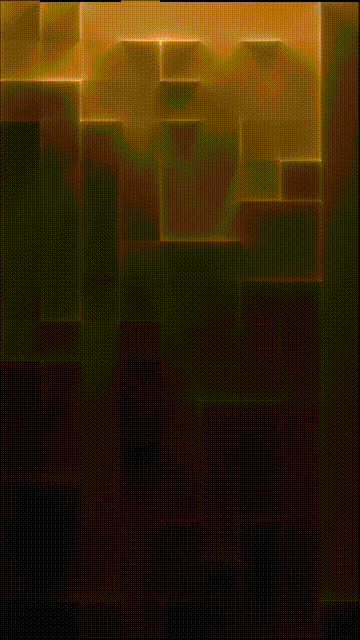

# Simple Shows - Raio

## Web version

The files are `raio.html` and `raio.js`.

### To configure

The configurations are:

+ `raio.html` (visual configurations / CSS):
  + The size of the square
  + The width of the each border
+ `raio.js` (pratical configurations):
  + *Delays* in ms
  + *The colours* of the walls and of the lightnings. CSS colours
  + *The size of the grid* in ammount of squares
  + *The probabilities* of horizontal and vertical walls

### To run

Simply run `raio.html` (double click it, after downloaded and, if needed, extracted).

## HQZ / NodeJS version



Powered by HQZ (High Quality Zen), from @scanlime/zenphoton, this version offers ray-tracing.

The files are:

+ `hqz-get-frame.js`
+ `hqz-run.js`
+ `hqz-process-output.cmd` (windows only)
+ `ffmpeg-render-gif.cmd` (windows only)
+ `ffmpeg-render-video.cmd` (windows only)

### Requires

Requires NodeJS installed.

### To configure

The configurations are:

+ `hqz-run.js`:
  + *The size of the grid* in ammount of squares
  + The random ray tracing *seed*
  + *The probabilities* of horizontal and vertical walls
  + The *exposure* (from `0` to `1`)
  + The rendered image *resolution*
  + The *time limit* for the rendering of each frame
  + The max count of *rays* to be traced at each frame
  + The relative *light power* of each *lighning* (the sky light has power 100)
  + The relative *light power* of each *search cell* (the sky light has power 100)

### To run

To calculate the lightning, configure it (in `hqz-run.js`), and run

```sh
node hqz-run.js
```

To render each image from each resulting json file, run

```sh
hqz-process-output.cmd
```

To render the images into a final file, run either

```sh
ffmpeg-render-video.cmd
```

or

```sh
ffmpeg-render-gif.cmd
```
